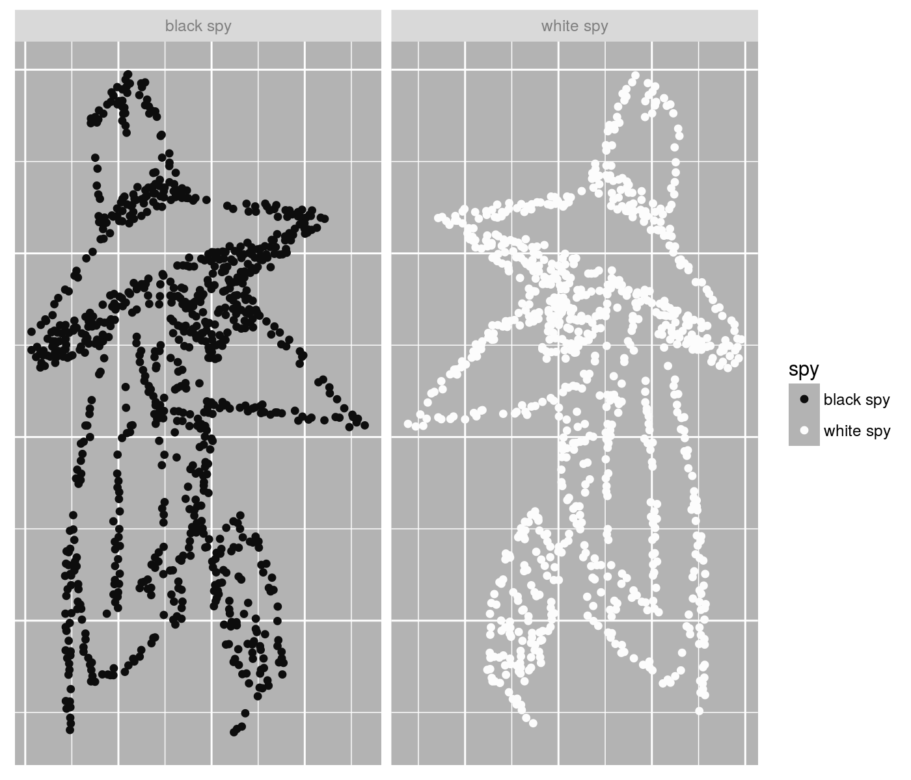

# SPYvsSPY

[](https://travis-ci.org/shabbychef/SPYvsSPY)
[](https://cran.r-project.org/package=SPYvsSPY)
[](http://www.r-pkg.org/pkg/SPYvsSPY)
[](http://www.r-pkg.org/pkg/SPYvsSPY)



  _Joke and Data_

Data on the 248 installments of the Spy vs Spy comic by Antonio Prohias
appearing in Mad Magazine: date, issue number, outcome, appearance of
Grey Spy, V for Victory. Not affiliated or endorsed by the Estate of
Antonio Prohias or Mad Magazine, a fan-curated dataset for the promotion
of Spy vs Spy scholarship.

-- Steven E. Pav, shabbychef@gmail.com

## Installation

This package can be installed 
from CRAN, 
via [drat](https://github.com/eddelbuettel/drat "drat"), or
from github:


```r
# via CRAN:
install.packages("SPYvsSPY")
# via drat:
if (require(drat)) {
  drat:::add("shabbychef")
  install.packages("SPYvsSPY")
}
# get snapshot from github:
if (require(devtools)) {
  install_github('shabbychef/SPYvsSPY')
}
```

## Use it

First get a basic look at the data. The data are documented in the package. For
each row we have the issue of Mad, the release date (as a character with format `%Y-%m`),
the page in the Spy vs. Spy Omnibus, the author and artist of the strip,
whether White Spy and Black Spy received a 'comeuppance' (_i.e._ were clubbed, 
eaten by lion, shot, _etc._), whether the Grey Spy appears (only in the 60's), 
and whether the victorious Spy flashes the 'V for Victory' sign (mostly in the
80's).


```r
library(dplyr)
library(knitr)
library(SPYvsSPY)

# this is it:
data(svs)
head(svs) %>%
	kable()
```


| Mad_no|yrmo    | omnibus_page|author          |artist          |white_comeuppance |black_comeuppance |grey_spy_appearance |v_for_victory |
|------:|:-------|------------:|:---------------|:---------------|:-----------------|:-----------------|:-------------------|:-------------|
|     60|1961-01 |           35|Antonio Prohias |Antonio Prohias |TRUE              |TRUE              |FALSE               |FALSE         |
|     60|1961-01 |           36|Antonio Prohias |Antonio Prohias |TRUE              |TRUE              |FALSE               |FALSE         |
|     60|1961-01 |           37|Antonio Prohias |Antonio Prohias |FALSE             |TRUE              |FALSE               |FALSE         |
|     61|1961-03 |           38|Antonio Prohias |Antonio Prohias |FALSE             |TRUE              |FALSE               |FALSE         |
|     61|1961-03 |           39|Antonio Prohias |Antonio Prohias |TRUE              |FALSE             |FALSE               |FALSE         |
|     62|1961-04 |           40|Antonio Prohias |Antonio Prohias |FALSE             |FALSE             |FALSE               |FALSE         |

Let's check on the appearances per year with a Stem-and-Leaf plot:


```r
library(SPYvsSPY)
# this is it:
data(svs)
stem(as.numeric(gsub('^(\\d{4})-.+','\\1',svs$yrmo)),scale=0.5) 
```

```
## 
##   The decimal point is 1 digit(s) to the right of the |
## 
##   196 | 1111111111111122222222222222333333333333334444444444444444444
##   196 | 5555555555555555555555566666666667777777777777788888888999999999999
##   197 | 0000000000000111111111111222222223333344444
##   197 | 55555566666666777788899999
##   198 | 0001111111222222333333334444444444
##   198 | 555566666667
##   199 | 2222
##   199 | 5
```

Compute a running net score of Black Spy victories:


```r
library(SPYvsSPY)
# this is it:
data(svs)
svs %>%
	mutate(black_victory=as.numeric(white_comeuppance) - as.numeric(black_comeuppance)) %>%
	mutate(net_black_victory=cumsum(black_victory)) %>%
	arrange(Mad_no) %>%
	mutate(decade=10 * as.numeric(gsub('^(\\d{3}).+$','\\1',yrmo))) %>%
	group_by(decade) %>%
		summarize(running_tally_net_black_victory=last(net_black_victory)) %>%
	ungroup() %>%
	kable()
```


| decade| running_tally_net_black_victory|
|------:|-------------------------------:|
|   1960|                              -2|
|   1970|                             -11|
|   1980|                              -5|
|   1990|                              -6|
Nearly equal. 


## Wald Wolfowitz

The [Wald Wolfowitz test](https://en.wikipedia.org/wiki/Wald%E2%80%93Wolfowitz_runs_test)
is a non-parametric test for the presence of serial correlation that is appropriate for
binary series like this. The test is performed by computing the number of 'runs', which
is to say the number of clusters of consecutive victories by one of the Spies. When the
test statistic is too high 
(compared to what would be observed if the data were serially independent), 
then the data are too 'flippy', often reversing. 
This would be the case if Prohias tried to keep score balance by always reversing the previous outcome.
If the test statistic is too low, the data are too 'sticky', with long periods of one Spy prevailing
over the other. This could happen if Prohias got moody and picked favorites, perhaps.

The test is easy enough to run using the `randtests` package:


```r
library(randtests)
subdata <- svs %>%
	filter(Mad_no > 152) %>%
	mutate(black_victory=as.numeric(white_comeuppance) - as.numeric(black_comeuppance)) %>%
	filter(abs(black_victory) > 0.5)
set.seed(1234)
resu <- randtests::runs.test(subdata$black_victory,threshold=0)
print(resu)
```

```
## 
## 	Runs Test
## 
## data:  subdata$black_victory
## statistic = 0.9, runs = 50, n1 = 40, n2 = 50, n = 90, p-value = 0.4
## alternative hypothesis: nonrandomness
```

We get back a test statistic of 0.85, indicating slightly
greater than random amount of reversal. However, this is not statistically
significantly different than the expected value of 0, with a p-value of
0.39.  

In conclusion, we have no evidence that Prohias kept running tally of Black
and White Spy victories, and the data are consistent with the victor being
chosen independently of the previous victories.

